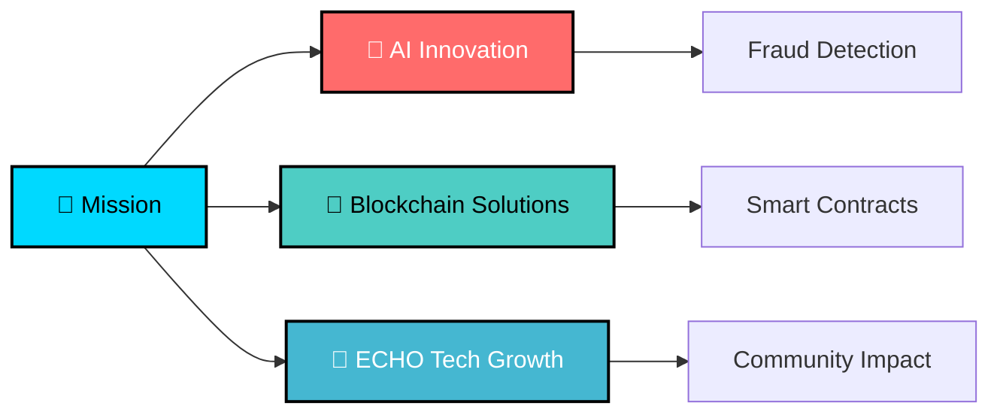

# <div align="center">⚡ **SHAURYA TAYAL** ⚡</div>

<div align="center">
  
</div>

<div align="center">
  
  [](https://linkedin.com/in/shaurya_wizard)
  [](https://github.com/ishouriya)
  [](mailto:shouriyatayl1234@gmail.com)

</div>

---

## 🎯 **WHO AM I?**

<div align="center">

**🎓 B.Tech CSE @ Lovely Professional University • CGPA: 7.03**  
**💼 Founder & COO @ ECHO Tech Organization**  
**🏆 3rd Place - Smart India Inter-University Hackathon 2023**

```python
class ShauryaTayal:
    def __init__(self):
        self.role = "Software Developer & ML Enthusiast"
        self.location = "Punjab, India 🇮🇳"
        self.academic_highlights = {
            "Machine Learning": "Outstanding Grade (O)",
            "DBMS": "A+ Grade",
            "Computer Programming": "A+ Grade"
        }
        self.passion = ["AI/ML", "Blockchain", "Problem Solving"]
        self.current_status = "Building next-gen solutions"
    
    def get_superpower(self):
        return "Transforming complex problems into elegant code"
```

</div>

---

## 🔥 **TECH MASTERY**

<div align="center">

### **🚀 Core Technologies**


### **🧠 AI/ML & Data**


### **🔗 Blockchain & Web**


</div>

---

## 🚀 **GAME-CHANGING PROJECTS**

<div align="center">

| 🎯 **Project** | 🔥 **Impact** | 💻 **Tech Stack** |
|:---:|:---:|:---:|
| **🛡️ FraudNet.AI** | 95% Fraud Detection Accuracy | Python • ML • Blockchain |
| **🗳️ Quanta Ballet** | Tamper-Proof Voting System | HyperLedger • Solidity • Flask |
| **🏥 DocPat** | Secure Medical Records | Blockchain • IPFS • Smart Contracts |
| **🚦 Smart Traffic AI** | Automated Traffic Control | Python • OpenAI • IoT Sensors |

</div>

---

## 🏆 **ACHIEVEMENTS UNLOCKED**

<div align="center">

🥉 **3rd Place** - Smart India Inter-University Hackathon 2023  
🥇 **1st Place** - Lego Playbotics League 2022 (State Level)  
🎪 **Organized** - Nationwide Hackathon (800+ Participants)  
🏛️ **Mentored** - Teams at HackWithMAIT & HackHound  

</div>

---

## 📊 **GITHUB DOMINATION**

<div align="center">
  
  
</div>

<div align="center">
  
</div>

---

## 🎯 **CURRENT MISSION**

<div align="center">



</div>

---

## 🌟 **LET'S BUILD THE FUTURE TOGETHER**

<div align="center">

### **🚀 Open for:**
**💡 Innovative Collaborations • 🎯 Technical Challenges • 🌟 Startup Ventures**

<br/>


</div>

---

<div align="center">
  
  **"Code is poetry written in logic"** ✨
  
  
  
</div>
