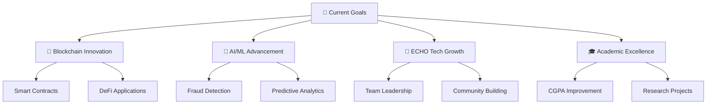

# <div align="center">🚀 Shaurya Tayal | Full Stack Developer & AI Enthusiast</div>

<div align="center">
  
</div>

<div align="center">
  
  [](https://linkedin.com/in/shaurya_wizard)
  [](https://github.com/ishouriya)
  [](mailto:shouriyatayl1234@gmail.com)
  [](tel:+918218109345)

</div>

---

## 🎯 About Me

```typescript
const shaurya = {
    location: "Phagwara, Punjab, India 🇮🇳",
    education: "B.Tech CSE @ Lovely Professional University",
    currentCGPA: 7.03,
    role: "Founder & COO @ ECHO Tech Organization",
    experience: "Support Intern @ Dell Technologies",
    
    passions: [
        "Building innovative solutions",
        "Blockchain technology",
        "AI/ML applications",
        "Mentoring developers"
    ],
    
    currentFocus: "Developing fraud detection systems with blockchain integration",
    availability: "Open to collaborations and opportunities"
};
```

---

## 🛠️ Tech Arsenal

<div align="center">

### 💻 Programming Languages


### 🌐 Web Technologies


### 🗄️ Databases


### 🔧 Tools & Platforms


</div>

---

## 🚀 Featured Projects

<div align="center">

<table>
<tr>
<td width="50%">

### 🔒 FraudNet.AI
**Real-time Fraud Detection System**
- 🎯 95% accuracy using ML algorithms
- 🔗 Blockchain audit logs integration
- 🛡️ Advanced security protocols
- 💼 Python, ML, Blockchain

</td>
<td width="50%">

### 🗳️ Quanta Ballet
**Decentralized Voting Platform**
- 🔒 Tamper-proof voting system
- 📱 User-friendly interface
- 🌐 HyperLedger, Solidity, Flask
- 🏛️ Democratic transparency

</td>
</tr>
<tr>
<td width="50%">

### 🏥 DocPat
**Secure Medical Records Exchange**
- 🔐 Smart contract integration
- 📊 IPFS distributed storage
- 🩺 Healthcare data security
- 💻 Blockchain, Flask, IPFS

</td>
<td width="50%">

### 🚦 Smart Traffic Management
**AI-Driven Traffic Control**
- 🤖 AI-powered optimization
- 📡 Real-time sensor integration
- 🚗 Reduces manual intervention
- 🧠 Python, OpenAI, IoT

</td>
</tr>
</table>

</div>

---

## 🏆 Achievements & Recognition

<div align="center">

| 🏅 Achievement | 🎯 Event | 📅 Year |
|:---:|:---:|:---:|
| 🥉 **3rd Position** | Smart India Inter-University Hackathon | 2023 |
| 🥇 **1st Position** | Lego Playbotics League (State Level) | 2022 |
| 🎪 **Organized** | Nationwide Hackathon (800+ participants) | 2023 |
| 🏛️ **Mentored** | HackWithMAIT & HackHound Teams | 2023 |

</div>

---

## 📊 GitHub Analytics

<div align="center">
  
  
</div>

<div align="center">
  
</div>

---

## 🎯 Current Focus

<div align="center">



</div>

---

## 📈 Activity Graph

<div align="center">
  
</div>

---

## 🤝 Let's Connect & Collaborate!

<div align="center">

### 💡 Always open to:
- 🚀 Innovative project collaborations
- 🎯 Technical discussions
- 🌟 Mentorship opportunities
- 📈 Startup ventures

<br/>


</div>

---

<div align="center">
  
  **"Code is like humor. When you have to explain it, it's bad."** - Cory House
  
  
  
</div>
