# Shaurya Tayal - Creative Developer & Digital Innovator

<!-- 3D Animated Header -->

  <svg width="100%" height="200" viewBox="0 0 800 200" xmlns="http://www.w3.org/2000/svg">
    <defs>
      <linearGradient id="textGradient" x1="0%" y1="0%" x2="100%" y2="100%">
        <stop offset="0%" style="stop-color:#00d4ff;stop-opacity:1" />
        <stop offset="50%" style="stop-color:#ff00ff;stop-opacity:1" />
        <stop offset="100%" style="stop-color:#ffff00;stop-opacity:1" />
      </linearGradient>
      <filter id="glow">
        <feGaussianBlur stdDeviation="3" result="coloredBlur"/>
        <feMerge> 
          <feMergeNode in="coloredBlur"/>
          <feMergeNode in="SourceGraphic"/>
        </feMerge>
      </filter>
    </defs>

<!-- Particle Background -->
<g class="particles">
  
  <circle cx="100" cy="50" r="1.5" fill="#00d4ff" opacity="0.6">
    <animate attributeName="cy" values="50;20;50" dur="3.0s" repeatCount="indefinite"/>
    <animate attributeName="opacity" values="0.6;1;0.6" dur="3.0s" repeatCount="indefinite"/>
  </circle>
  <circle cx="200" cy="70" r="2.0" fill="#ff00ff" opacity="0.6">
    <animate attributeName="cy" values="70;40;70" dur="3.5s" repeatCount="indefinite"/>
    <animate attributeName="opacity" values="0.6;1;0.6" dur="3.5s" repeatCount="indefinite"/>
  </circle>
  <circle cx="300" cy="90" r="2.5" fill="#ffff00" opacity="0.6">
    <animate attributeName="cy" values="90;60;90" dur="4.0s" repeatCount="indefinite"/>
    <animate attributeName="opacity" values="0.6;1;0.6" dur="4.0s" repeatCount="indefinite"/>
  </circle>
  <circle cx="400" cy="50" r="1.5" fill="#00ff88" opacity="0.6">
    <animate attributeName="cy" values="50;20;50" dur="4.5s" repeatCount="indefinite"/>
    <animate attributeName="opacity" values="0.6;1;0.6" dur="4.5s" repeatCount="indefinite"/>
  </circle>
  <circle cx="500" cy="70" r="2.0" fill="#ff6600" opacity="0.6">
    <animate attributeName="cy" values="70;40;70" dur="5.0s" repeatCount="indefinite"/>
    <animate attributeName="opacity" values="0.6;1;0.6" dur="5.0s" repeatCount="indefinite"/>
  </circle>
  <circle cx="600" cy="90" r="2.5" fill="#8800ff" opacity="0.6">
    <animate attributeName="cy" values="90;60;90" dur="5.5s" repeatCount="indefinite"/>
    <animate attributeName="opacity" values="0.6;1;0.6" dur="5.5s" repeatCount="indefinite"/>
  </circle>
</g>

<!-- 3D Text Effect -->
<g class="main-text">
  <!-- Shadow layer -->
  <text x="400" y="120" text-anchor="middle" font-family="Arial, sans-serif" font-size="42" font-weight="bold" fill="#333" opacity="0.3" transform="translate(3,3)">
    Shaurya Tayal
  </text>
  <!-- Main text -->
  <text x="400" y="120" text-anchor="middle" font-family="Arial, sans-serif" font-size="42" font-weight="bold" fill="url(#textGradient)" filter="url(#glow)">
    Shaurya Tayal
    <animateTransform attributeName="transform" type="rotate" values="0 400 120;2 400 120;0 400 120;-2 400 120;0 400 120" dur="6s" repeatCount="indefinite"/>
  </text>
</g>

<!-- Subtitle -->
<text x="400" y="150" text-anchor="middle" font-family="Arial, sans-serif" font-size="18" fill="#666">
  Software Engineering Student & Full-Stack Developer
  <animate attributeName="opacity" values="0.5;1;0.5" dur="4s" repeatCount="indefinite"/>
</text>
</svg>

---

## 🚀 About Me

> Computer Science undergrad with hands-on experience in full-stack development, ML, and systems programming. Founder & COO of ECHO Tech Organization. Passionate about innovation, team leadership, and creating technology that makes a difference.

---

<!-- Skills Visualization -->

## 💻 Technical Arsenal

### Programming Languages

**Python** 

  

**C++** 

  

**Java** 

  

**JavaScript** 

  

**C** 

  

### Frameworks & Technologies

                   

---

## 📊 GitHub Analytics

  

---

## 🎯 Featured Projects

<table>
<tr>
<td width="50%">

---

## 🌟 Current Focus

```mermaid
graph LR
    A[🤖 Full-Stack Development] --> B[🌐 Machine Learning & AI]
    B --> C[📱 Blockchain Technology]
    C --> D[☁️ System Design & Architecture]
    D --> A
  
    style A fill:#ff6b6b
    style B fill:#4ecdc4
    style C fill:#45b7d1
    style D fill:#f9ca24
```

**Currently exploring:** Full-Stack Development, Machine Learning & AI, Blockchain Technology, System Design & Architecture

---

## 📫 Let's Connect

  

### 💡 Open to collaborations, interesting projects, and tech discussions!

**Current Status:** 🟢 Available for internships and opportunities
**Location:** 🌍 Phagwara, Punjab, India
**Timezone:** 🕐 IST (UTC+5:30)

---

---

### 🎨 "Code is poetry, and I'm here to write verses that inspire."

<!-- Visitor Counter -->

**Thanks for visiting! ⭐ Star my repositories if you find them interesting!**

